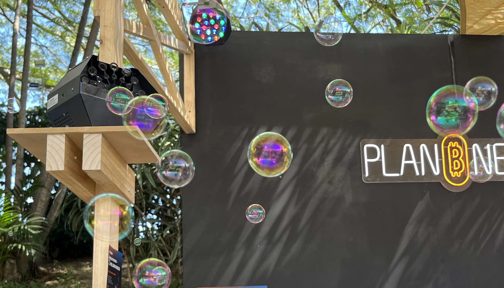

# ⚡ Lightning Bubble Machine

→ Trigger a bubble machine with a Bitcoin Lightning payment, built with an ESP32, BTCPay Server + Blink, and a custom Arduino sketch.

*⚡ Real test on the main stage at Plan ₿ Forum, San Salvador 2026*

- **Level:** Intermediate
- **Estimated time:** 2-3 hours
- **Use cases:** Bitcoin events, kids activities, Lightning demos, conference booths

## How it works

1. A Lightning invoice is displayed on screen
2. The payment is detected by BTCPay Server + Blink
3. The ESP32 receives the payment event via WebSocket
4. The ESP32 sends a short pulse to Relay 1 (ON), waits, then a short pulse to Relay 2 (OFF)

## Hardware

### Electronic components

- ESP32-WROOM-32 microcontroller
- 2x 5V relay module with optocoupler
- Bubble machine with two-button remote control (ON/OFF)
- Dupont cables: Male/Male and Male/Female
- 5V USB power supply or Li-Po battery
- Micro-USB cable

### Tools

- Soldering iron + tin (or Dupont connectors)
- Screwdriver
- Multimeter (recommended)

### Built with

- [BTCPay Server](https://btcpayserver.org/)
- [Blink](https://www.blink.sv/)
- Arduino IDE

## Wiring

Coming soon (hardware build in progress).

## Software

This project uses a custom Arduino sketch because the bubble machine requires two separate relay signals (ON and OFF).

The ESP32 code is in the `code/` folder.

## License

MIT © 2026 Ezmo
